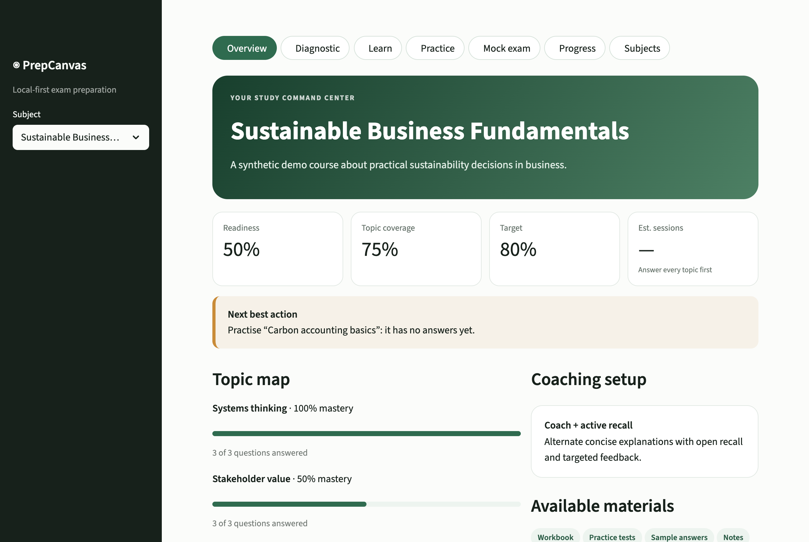
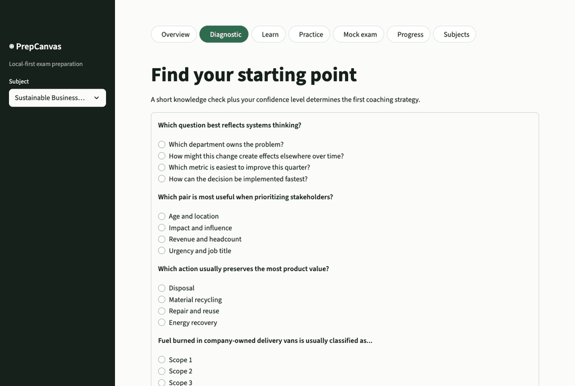
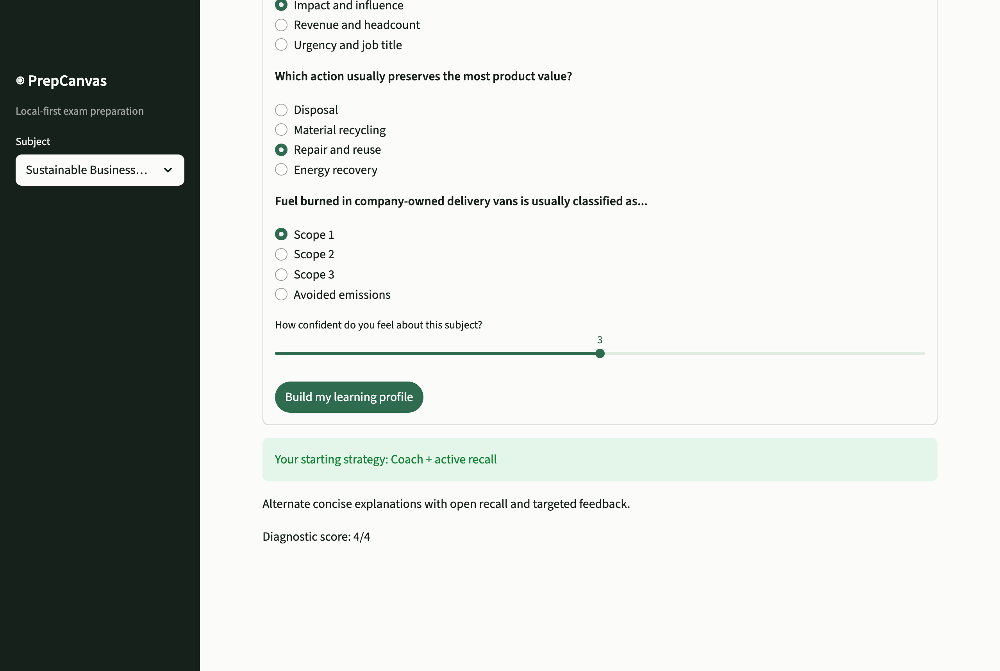
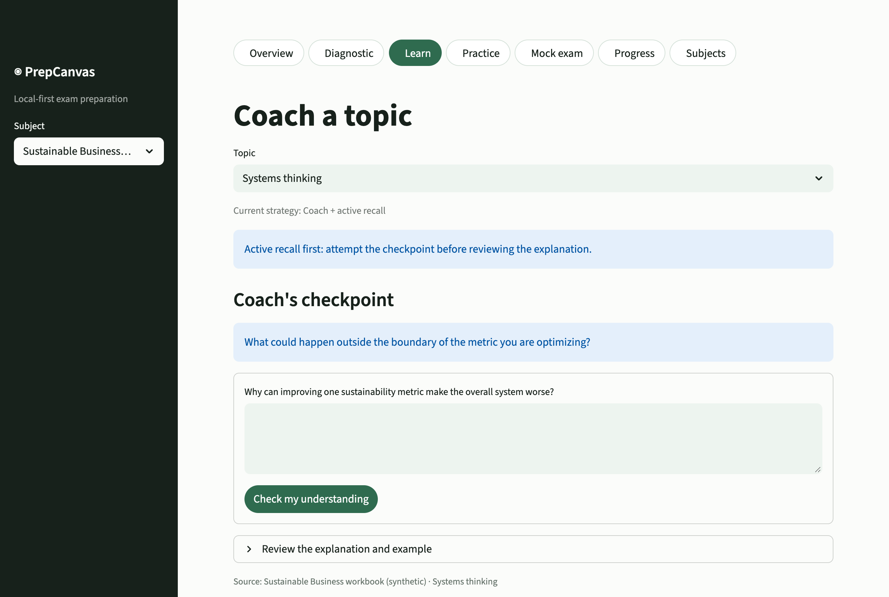
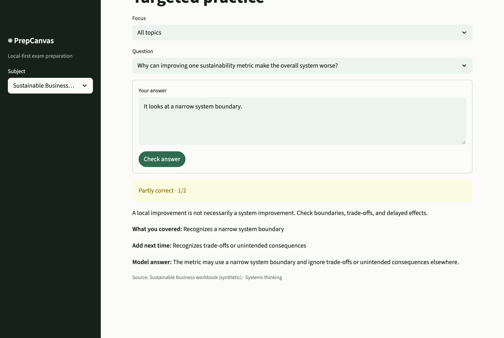
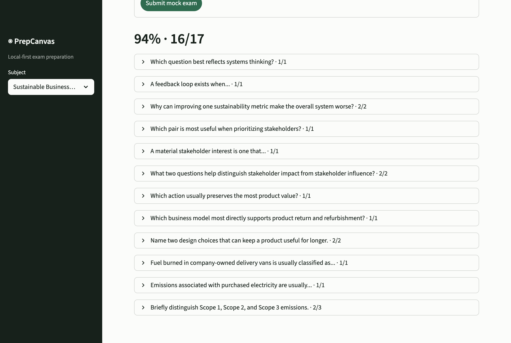
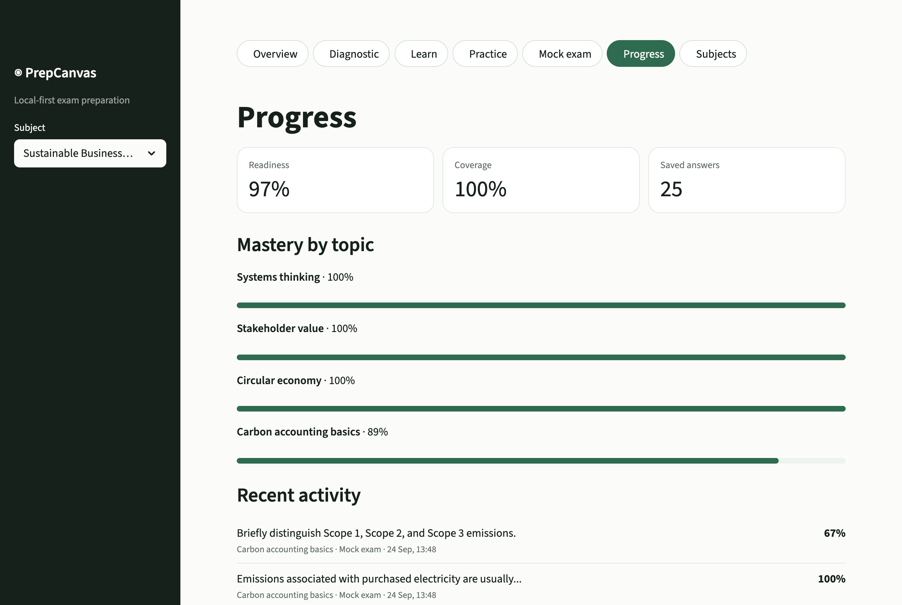
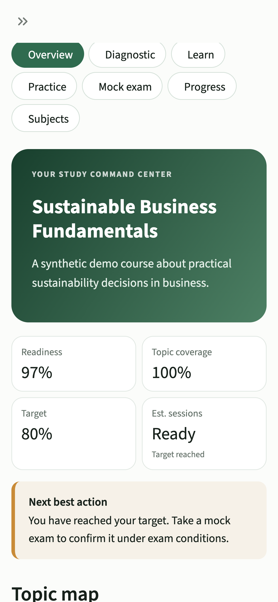

# PrepCanvas

PrepCanvas is a local-first exam preparation companion that turns a subject into a clear study path: diagnose what you know, learn with a coaching flow, practise retrieval, and track readiness over time.

The public repository ships with a fully synthetic subject, **Sustainable Business Fundamentals**. No university course material, personal answers, or private transcripts are included.



## See it in action



| Diagnostic sets a coaching strategy | Learn with that strategy |
|---|---|
|  |  |
| **Source-labelled practice feedback** | **Mock exam with delayed feedback** |
|  |  |
| **Progress by topic and recent activity** | **Phone layout** |
|  |  |

All media show the synthetic demo subject and are generated by [`scripts/capture_media.py`](scripts/capture_media.py).

## Why this project exists

Exam preparation is often split across workbooks, notes, sample tests, model answers, and session transcripts. Students spend time organizing material but still struggle to answer three practical questions:

1. What do I understand right now?
2. What should I study next?
3. Am I ready for the exam?

PrepCanvas brings those decisions into one local workspace.

## Current MVP

- multi-subject local workspace for metadata and progress isolation
- material inventory for each subject
- synthetic demo course with four topics and twelve questions
- short diagnostic that selects a starting coaching strategy
- guided topic explanations, examples, common traps, and recall checks
- targeted practice with immediate, source-labelled feedback
- mock exam with delayed feedback
- SQLite progress storage isolated by subject
- transparent readiness, coverage, and study-session estimates
- no API key required

## Product principles

- **Source grounded:** feedback should be traceable to supplied materials.
- **Local first:** personal materials, answers, and progress stay on the user's machine.
- **Learning before generation:** the product should improve understanding, not only create more content.
- **Transparent signals:** readiness is presented as a heuristic, never as a guaranteed grade.
- **AI optional:** future model integrations extend the core workflow instead of being required to run it.

## Quick start

Requirements: Python 3.9+; Python 3.12 is recommended. `setup.sh` picks the newest Python 3 it finds, or the one in `PYTHON_BIN`.

```bash
./scripts/setup.sh
./scripts/run_app.sh
```

Open [http://localhost:8501](http://localhost:8501).

The helper scripts target macOS and Linux. On Windows, create a virtual environment with `py -m venv .venv`, activate `.venv\Scripts\activate`, install `requirements.txt`, and run `streamlit run app/streamlit_app.py` with `PYTHONPATH=src` configured for the shell.

Run the test suite:

```bash
./scripts/run_tests.sh -q
```

Manual setup:

```bash
python3 -m venv .venv
. .venv/bin/activate
pip install -r requirements.txt
PYTHONPATH=src streamlit run app/streamlit_app.py
```

## Repository structure

```text
.github/
  workflows/ci.yml        Tests and privacy checks
  pull_request_template.md
app/
  streamlit_app.py        Streamlit user interface
docs/
  media/                  README screenshots and demo GIF
  architecture.md
  product-brief.md
  research-notes.md
  roadmap.md
src/prepcanvas/
  demo_data/              Synthetic source and derived demo dataset
  catalog.py              Demo content loading
  coaching.py             Diagnostic-to-strategy rules
  grading.py              Deterministic grading
  readiness.py            Readiness heuristics
  storage.py              SQLite persistence
tasks/                    Task board and task files (TASK-NNN)
tests/
```

Runtime data is created in `data/local/` and ignored by Git.

## Current limitations

- The bundled synthetic demo is the only study-ready subject in this release.
- Newly created subjects currently store metadata and material availability only; local document ingestion is the next product iteration.
- Questions and rubrics in the demo dataset are pre-authored from the bundled synthetic source rather than generated at runtime.
- The readiness estimate is a planning heuristic and has not yet been calibrated against real exam outcomes.

## Privacy and content safety

The repository intentionally excludes:

- uploaded workbooks and notes
- institutional exam papers and model answers
- transcripts and recordings
- local SQLite databases
- generated artifacts containing source text
- environment files and API keys

The bundled demo course is original synthetic content created specifically for this repository. Its canonical source is [the synthetic workbook](src/prepcanvas/demo_data/sustainable_business_source.md); the adjacent JSON file contains the derived topics, questions, rubrics, and source labels used by the app.

## Readiness model

The current readiness score is deliberately simple and inspectable:

- only the latest answer to each question counts, so repeating one question adds no extra evidence;
- topic mastery is weighted accuracy across those answers, where mock-exam answers weigh 1.5× and every answer loses half its weight each 14 days;
- mastery is multiplied by an evidence factor that reaches full strength after three distinct, recent questions in the topic;
- overall readiness is the average topic mastery;
- `Ready` requires both the target score and evidence across every topic;
- the session estimate appears only once every topic has evidence and assumes roughly eight readiness points per focused session.

The session estimate is a planning aid, not a prediction guarantee. A later iteration will validate the model against repeated mock-exam performance.

## Roadmap

Near-term work includes source upload and ingestion, richer topic diagnostics, spaced review, a more polished visual system, and exportable progress summaries. Optional local and cloud AI providers are planned after the deterministic workflow is reliable. Voice practice remains an exploratory future feature.

See [docs/roadmap.md](docs/roadmap.md) for the staged plan and the [task board](tasks/README.md) for the concrete, prioritized backlog.

## Development workflow

Work is planned and delivered as numbered tasks:

1. Each change starts as a task file in [`tasks/`](tasks/) with context, evidence, and acceptance criteria.
2. It is implemented on a `task/TASK-NNN-short-slug` branch with [Conventional Commits](https://www.conventionalcommits.org/) that reference the task ID.
3. It is merged through a pull request that follows a shared definition of done and is recorded in [CHANGELOG.md](CHANGELOG.md).

The test suite also checks that the task board stays consistent with the task files. See [CONTRIBUTING.md](CONTRIBUTING.md) for details.

## AI-assisted development

This project uses AI-assisted development for product exploration, implementation support, test design, and documentation. Product decisions, acceptance criteria, privacy boundaries, and final verification remain human-directed.

## What I owned

- product concept, problem framing, and MVP scope;
- privacy boundaries for real academic materials;
- deterministic-first architecture and AI-provider roadmap;
- acceptance criteria, exploratory testing, and release decisions;
- iterative UI and learning-flow design with AI-assisted implementation.

## License

MIT. See [LICENSE](LICENSE).
